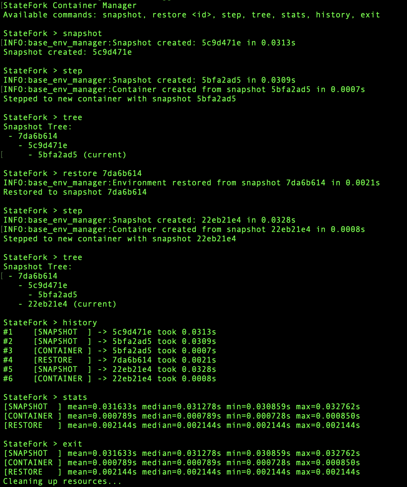

# StateFork Interfaces

## ⚙️ Interactive CLI Interface

### 1. Launch the Interactive Shell
```bash
(sudo) python3 -m interface.shell --method {method}
```
Currently supported methods:
- `docker` (default) - for Docker-based environments focused on filesystem snapshots
- `podman` - for Podman-based environments focused on filesystem snapshots
- `criu` - for CRIU-based environments focused on process state snapshots
- `hybrid` - for Podman+CRIU environments combining filesystem and process state snapshots
- `waypoint` - for Waypoint environments
- `ckpt` - legacy alias for `waypoint`

### 🗃️ Versioning an External Dolt Database
StateFork can version an **external** [Dolt](https://github.com/dolthub/dolt) database in lockstep with the
file-system/process snapshots, using Dolt's own branching. The database lives outside the StateFork shell — the managed
app talks to it directly — and StateFork only versions it. Enable it by pointing at the Dolt repo directory:
```bash
(sudo) python3 -m interface.shell --method {method} --dolt-repo /path/to/dolt_db
```
| Flag                     | Default | Description                                                              |
|--------------------------|---------|--------------------------------------------------------------------------|
| `--dolt-repo`            | _(off)_ | Path to the external Dolt repo; providing it enables Dolt control        |
| `--dolt-branch-prefix`   | `sf_`   | Prefix for the per-snapshot Dolt branch names                            |
| `--dolt-working-branch`  | `main`  | Dolt branch used for live work between snapshots                         |

When enabled, each `snapshot` commits the current Dolt working set and points a `sf_<id>` branch at it; each `restore`
resets the working branch back to the matching snapshot branch. Requires the `dolt` binary on `PATH`; if it is missing,
StateFork prints a notice and continues with file-system snapshots only.

### 2. Inside the Interactive Shell
After launching the shell with the desired method, you will see a prompt similar to this:
```
StateFork Container Manager - Interactive Shell
Commands: snapshot, restore <id>, step, tree, stats, history, storage, exit

StateFork > _
```
See the sample run screenshot below.

### 3. Common Commands
| Command	      | Description                                              |
|---------------|----------------------------------------------------------|
| snapshot	     | Take a snapshot of the current state                     |
| restore {id}	 | Roll back to a given snapshot ID                         |
| step	         | Snapshot and restore immediately to simulate progression |
| cmd {command} | Execute a shell command inside the managed environment   |
| tree	         | Show snapshot tree structure                             |
| stats	        | Show benchmarking results                                |
| history	      | Show operation history                                   |
| storage	      | Show storage usage and details                           |
| exit	         | Clean up and exit the manager                            |

### 📸 Sample Run



## 🚀 RPC Interface

To be implemented in the future, allowing remote management of snapshots and state.